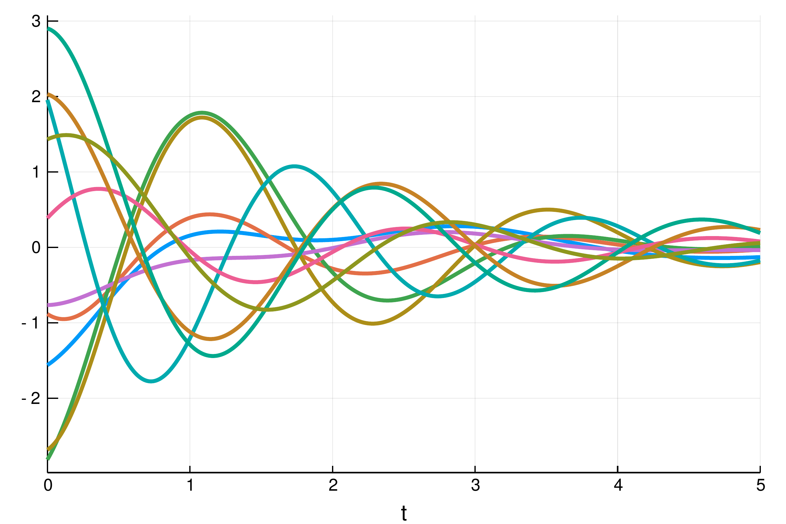

# Dynamic edges

OUTDATED

#### Scalar variables

In general, currents do not solely depend on the vertex values they are connecting, but rather depend on its own value in some sort. For the case of scalar variables, we may use the function nd_ODE_ODE_scalar:

```julia
sdl = nd_ODE_ODE_scalar(vertices!,edges!,g)
```

The function arguments are now of the following form:

```julia
vertices
edges
```

Compared to the static edges case with scalar variables, the vertices! function keeps its structure whereas the edges! function gets the new argument de[m]. This de[m] is the derivative of the edge value of edge m.
Let's look at a simple example: A system with dynamic edges which decay to the usual diffusive system:

```julia
vertices! = [(dv,v,l_s,l_t,p,t) -> dv .= sum(e_s) .- sum(e_t) for vertex in vertices(g)]
edges! = [(de,e,v_s,v_t,p,t) -> de .= 1000*(v_s .- v_t .- e) for edge in edges(g)]
```

The change compared to the example for the static case should be clear; the factor of 1000 is just accelerating the decay. Again, we can quite simply solve this system. One has to be aware though that now one needs initial values for the vertices and the edges! These are given in the order x0 = [vertex1,vertex2,...,edge1,edge2,...]:

```julia
g = barabasi_albert(10,5) #generates a graph with 10 vertices and 25 edges
x0 = rand(10 + 25)
t = (0.,2.)
sdl = nd_ODE_ODE_scalar(vertices!,edges!,g)
sdl_prob = ODEProblem(sdl,x0,t)
sol = solve(sdl_prob)
plot(sol, legend = false , vars = 1:10)
```
(Hier sollte ein Bild sein)

We see that the plot looks pretty much the same as for the static edges case. That is, because we included the factor of 1000 in the edges! function. Note that we added the argument vars to the plot function, this gives us solely the first 10 arguments of x which are the vertices. One could also get just the edge values by writing vars = 11:35 if one wishes.


#### Vector variables

The step here is not a hard one, if one read through the previous Vector variables section. We can treat a system of vector variables with dynamic edges with the function dynamic_edges:

```julia
dl = dynamic_edges(vertices!,edges!,g,dim_v,dim_e)
```

One has to apply the same change to the vertices! function as for the static_edges function. Otherwise, everything should be clear. For the example, we take the decaying dynamic edges and just make two independent networks as for the Static edges:

```julia
dim_v = 2 * ones(Int32, length(vertices!))
dim_e = 2 * ones(Int32, length(edges!))
g = barabasi_albert(10,5)

function vertex!(dv, v, e_s, e_d, p, t)
    dv .= 0
    for e in e_s
        dv .-= e
    end
    for e in e_d
        dv .+= e
    end
    nothing
end

vertices! = [vertex! for vertex in vertices(g)]
edges! = [(de,e,v_s,v_t,p,t) -> de .= 1000*(v_s .- v_t .- e) for edge in edges(g)]

dl = dynamic_edges(vertices!,edges!,g,dim_v,dim_e)

x0 = rand(10 + 10 + 25 + 25)
t= (0.,2.)
dl_prob = ODEProblem(dl,x0,t)
sol= solve(dl_prob)
plot(sol, legend = false, vars = 1:20)
```


We get the same pattern as for the scalar case, just twice.
