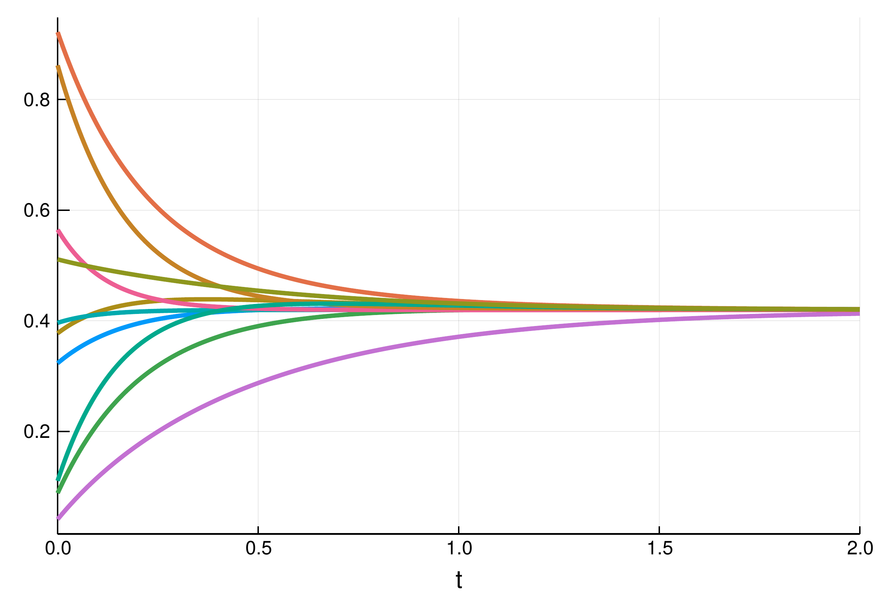

# Static edges

OUTDATED

#### Scalar variables

We will first look into the case where there is only a scalar variable on each vertex.
A dynamical network with static edges (static meaning that the current on an edge depends solely on the
values on the vertices it connects) is created via the nd_ODE_Static_scalar function:

```julia
ssl = nd_ODE_Static_scalar(vertices!, edges!, g)
```

The functions vertices! and edges! are of the form:

```julia
vertices
edges  
```

Specifically, the given variables are:

```julia
e_s[n] = [e[m] if s[m] == n for m in 1:length(edges!)]
e_t[n] = [e[m] if t[m] == n for m in 1:length(edges!)]
v_s= v[s[m]]
v_t= v[t[m]]
```
The vectors s and t contain the information about the source and target of each
edge, i.e. s[1] == 2 -> The source of edge 1 is vertex 2. The function creates
these vectors from the given graph, they can be accessed via the calling syntax
ssl.s_e or ssl.t_e.
The vectors e_s[n] and e_t[n] are containing the in- and outgoing edge values (or currents)
of vertex n in the form of an array. Thus, one would classically sum over these in vertices!,
but one is not restricted on doing this.

For example, a system of equations describing a simple diffusive network would be:

```julia
using LightGraphs
g= barabasi_albert(10,5)
vertices! = [(dv,v,l_s,l_t,p,t) -> dv .= sum(e_s) .- sum(e_t) for vertex in vertices(g)]
edges! = [(e,v_s,v_t,p,t) -> e .= v_s .- v_t for edge in edges(g)]
```

Here, the diffusiveness lies within the edges! function. It states that there is only
a current between two vertices if these vertices have a non-equal value. This current then ultimatively
leads to an equilibrium in which the value on any connected vertex is equal.

Note that one should (for performance reasons) and actually needs to put a dot before the mathematical operators.
This is due to the use of views in the internals of the nd_ODE_Static_scalar function.

We finally want to solve the defined diffusive system. This we do by using the well-known
package DifferentialEquations.jl (see [here](http://docs.juliadiffeq.org/latest/)). We also need to specify a set of initial values x0 as well as a time
interval t for which we are solving the problem:

```julia
using DifferentialEquations
using Plots
x0 = rand(10)
t = (0.,2.)
ssl = nd_ODE_Static_scalar(vertices!,edges!,g)
ssl_prob = ODEProblem(ssl,x0,t)
sol = solve(ssl_prob)
plot(sol, legend = false)
```



As one would expect in a diffusive network, the values on the vertices converge.
